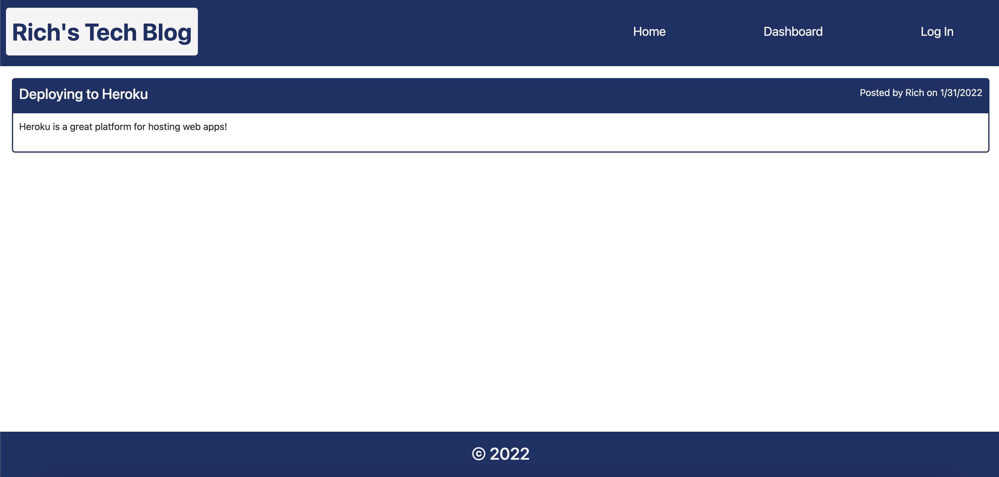

# richs-tech-blog 

## Description

A website for creating and sharing blog posts about your favorite coding topics. A user can sign up for an account or log into an existing account, after which they are redirected to a dashboard where they can view their past posts and click a button to create a new post. The homepage lists all posts, and clicking on a post opens a more detailed view that includes a comments section.

## Table of Contents

- [Usage](#usage)
- [Questions](#questions)

## Usage

Navigate to richs-tech-blog.herokuapp.com in your browser.

## Questions

My profile: https://github.com/rykaplan1

Please send any questions to rykaplan1@gmail.com